# 이력서
Github : https://github.com/taewan0530
Old Portfolio : http://taewan.co.kr

# 경력

[피알앤디컴퍼니](http://www.prnd.co.kr/)
- 2015/11 ~ 현재

[마인드퀘이크](https://www.startupkorea.com/companies/mindquake/)
- 2015/09 ~ 2015/11

[선데이벅스](http://sundaybugs.com/)
- 2014/09 ~ 2015/09

[버킷플레이스](http://bucketplace.co.kr/)
- 2013/09 ~ 2014/09

## 개인 프로젝트

### Daylight

시간대의 느낌을 표현한든 필터카메라
- 기간: 2016/4/18 ~ 2016/7/12
- 사용기술 : Swift, Realm, GPUImage
- AppStore (https://itunes.apple.com/kr/app/id1114370404)

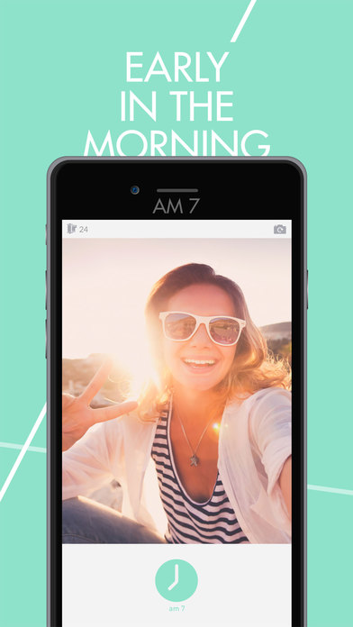 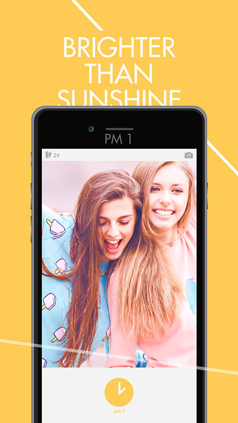 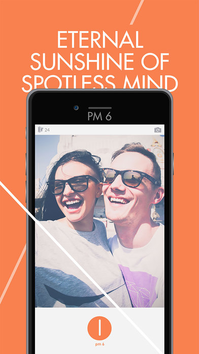 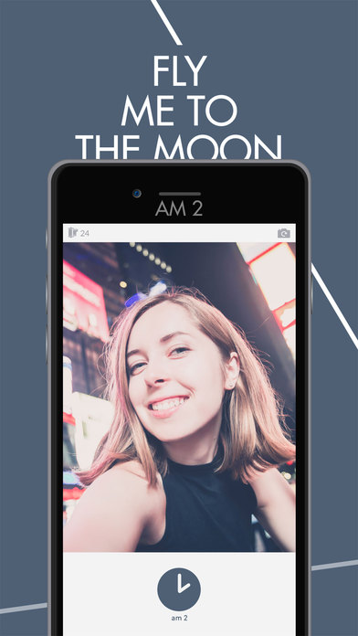

### Preview for Instagram

인스타그램에 사진을 올리기전에 올라가있는 사진과 함께 미리보는 앱
- 기간 : 2016/3/18 ~ 2016/8/29
- 사용기술 : Swift, GPUImage
- AppStore (https://itunes.apple.com/kr/app/id1148486412)

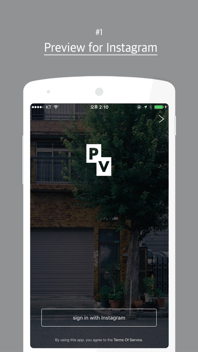 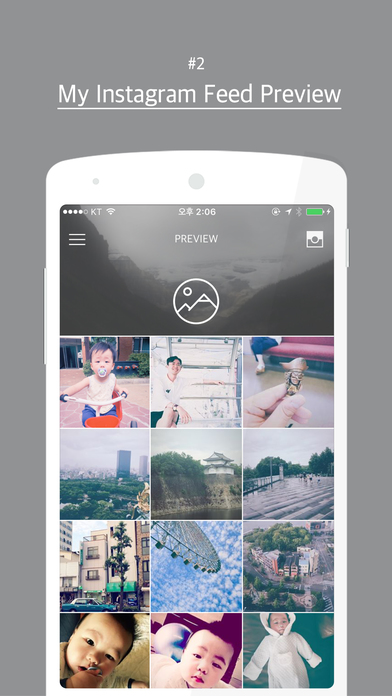 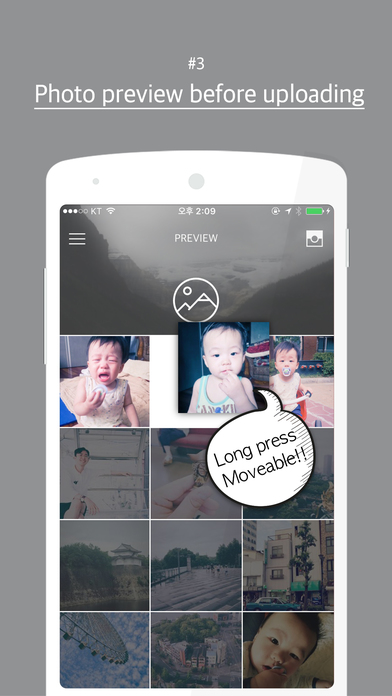 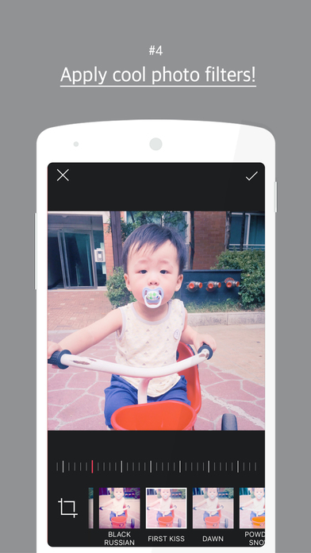 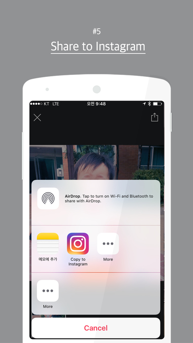

## 회사 프로젝트

### 헤이딜러
- 소속 : 피알앤디컴퍼니 
- 역할 : iOS 앱 개발
- 기간 : 2016/06/15 ~ 현재
- 사용기술 : iOS, Swift(3.0), RxSwift
- AppStore (https://itunes.apple.com/kr/app/id980166975)

 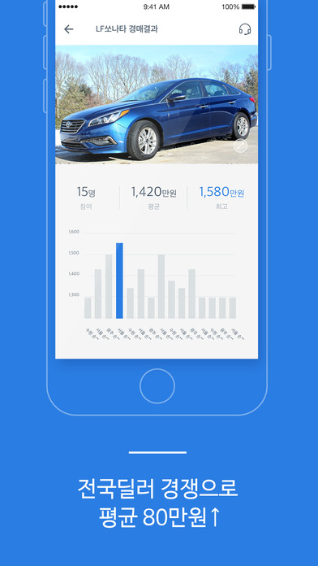  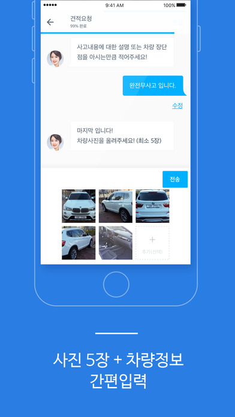 

### 헤이딜러(딜러용)
- 소속 : 피알앤디컴퍼니 
- 역할 : iOS 앱 개발
- 기간 : 2016/06/15 ~ 현재
- 사용기술 : iOS, Swift(3.0), Firebase, RxSwift
- AppStore (https://itunes.apple.com/kr/app/id1147518289)

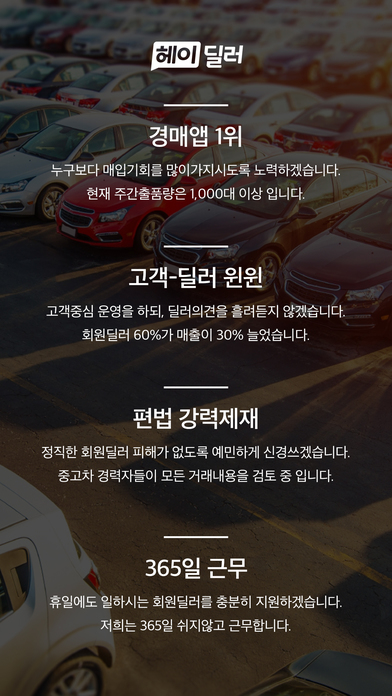 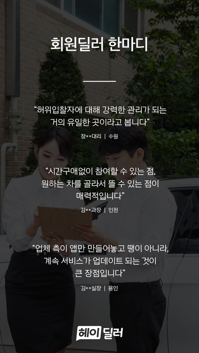 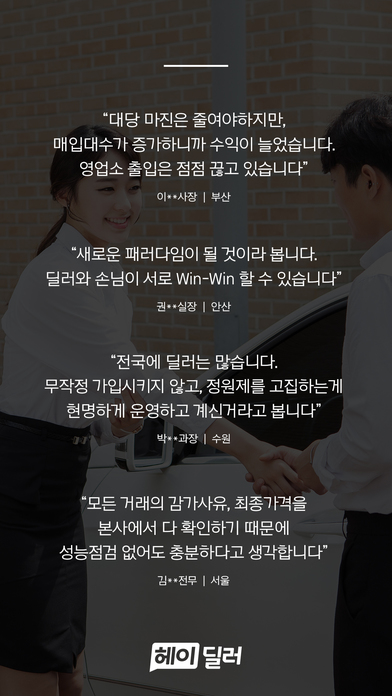 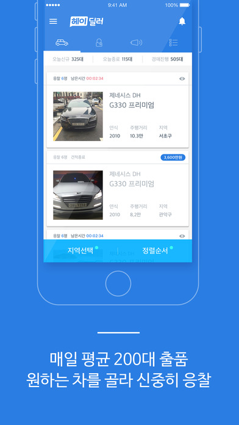 

### 카큐™
중고차 시세계산기
중고차들의 가격변동과 중고차의 판매가격을 예측
정책적으로 핵심기능은 비활성상태

- 소속 : 피알앤디컴퍼니 
- 역할 : iOS 앱 개발
- 기간 : 2016/01/05 ~ 2016/06/07
- 사용기술 : iOS, Swift(2.3)
- AppStore (https://itunes.apple.com/kr/app/id1084930611)

### 시간표-타임스프레드
지인의 의뢰로 진행한 외주 프로젝트
시간표 관리하는 어플리케이션

- 발주: J CONNECT
- 역할 : iOS 앱 개발
- 기간 : 2016/01/14 ~ 2016/03/28
- 사용기술 : iOS, Swift(2.3), Realm
- AppStore (https://itunes.apple.com/kr/app/id457130897)

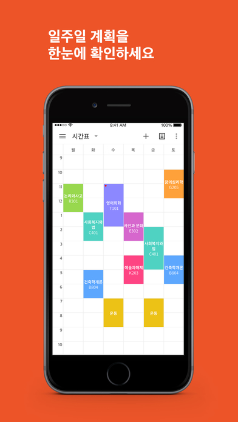 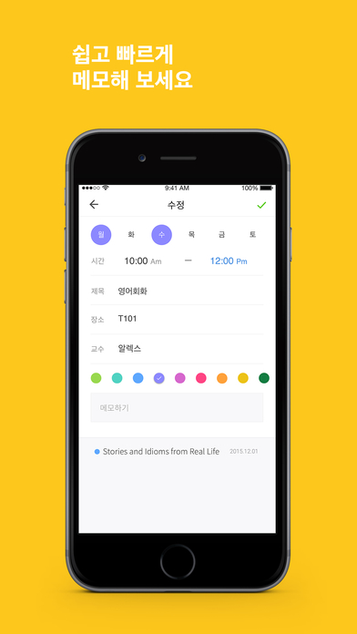 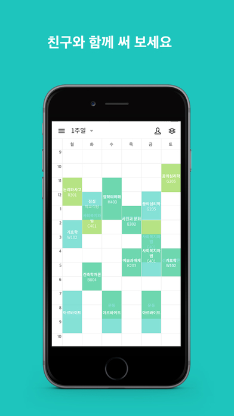

### 두포토
사진가들이 사진을 찍고 고객들과 손쉽게 사진을 공유하고 관리하기위한 서비스

- 소속 : 마인드퀘이크
- 역할 : 서버(초기 구조 작업), 웹 개발
- 기간 : 2015/08/28 ~ 2015/10/30
- 사용기술 : AngularJS, Node.js, HTML, CSS
- Site (http://dophoto.co)

### 썸머
커플끼리 사진을 찍고 공유하기가 불편하다는 포인트를 개선하기 위해서 제작한 커플사진앱

- 기간 : 2015/01/11 ~ 2015/08/28
- 소속 : 선데이벅스
- 역할 : Android, iOS, 서버
- 사용기술 : Java, Swift(2.3), GPUImage, Node.js
- 서비스종료

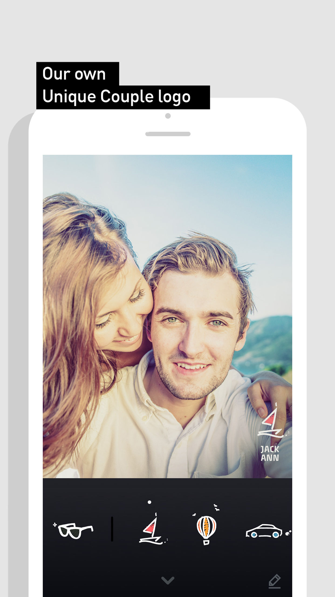 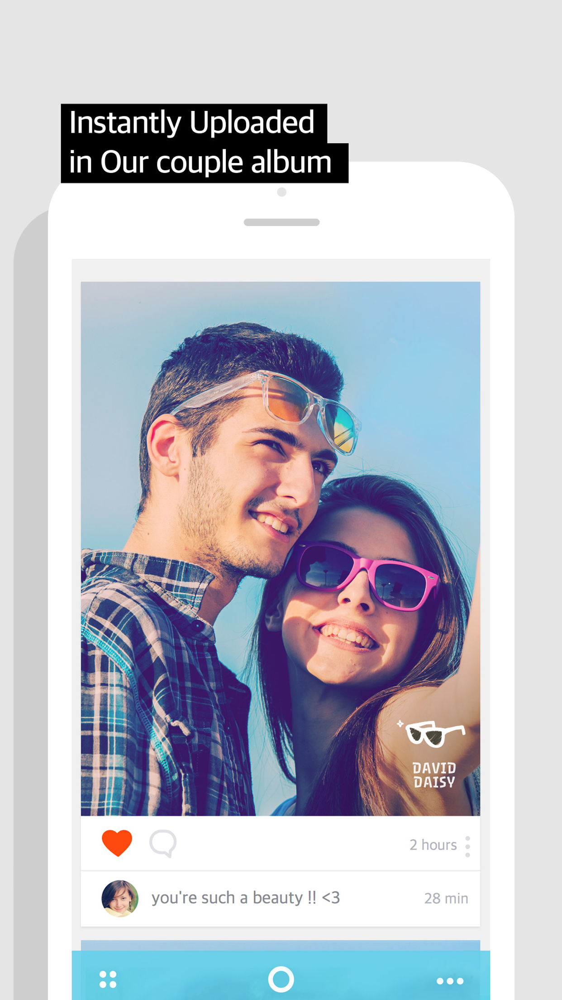 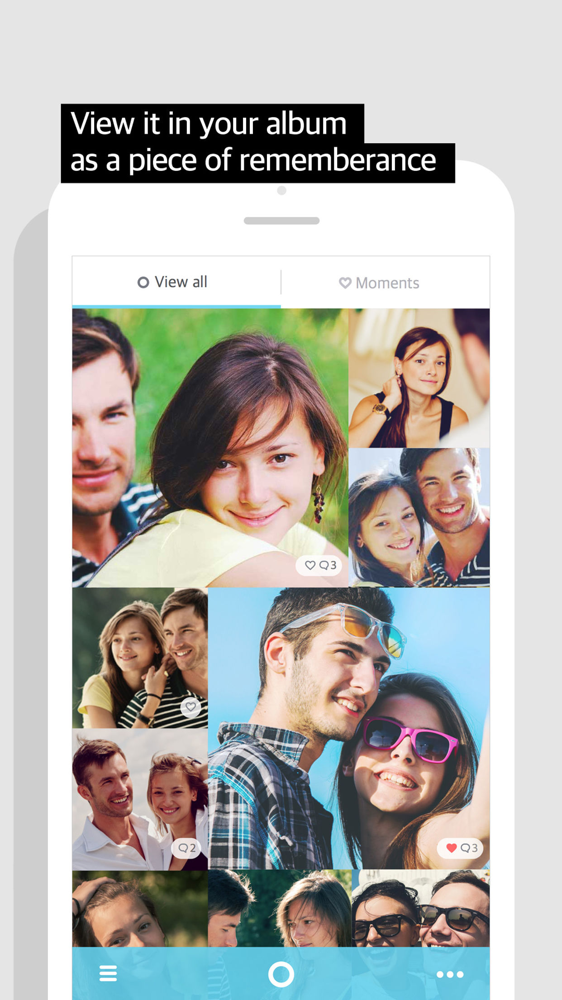 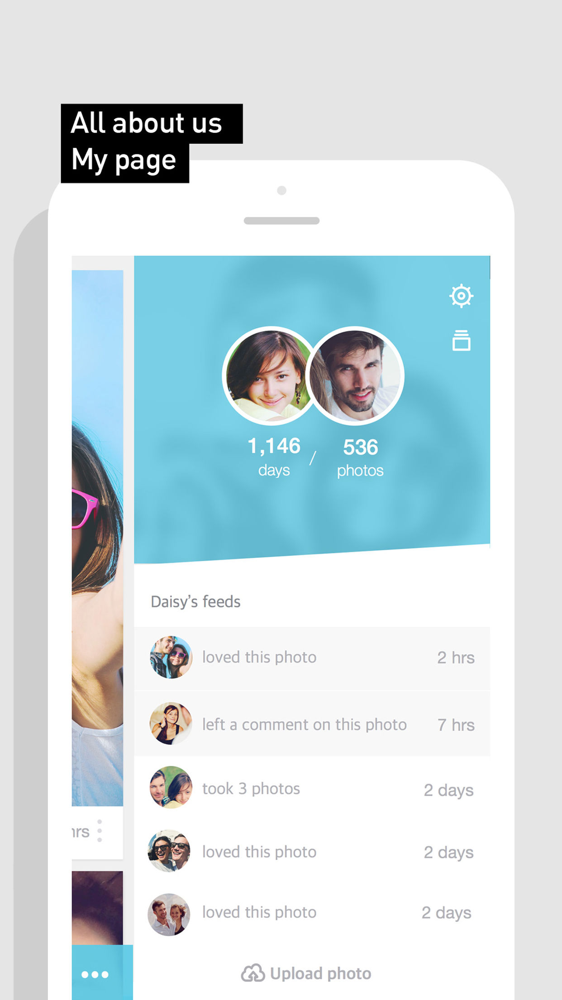 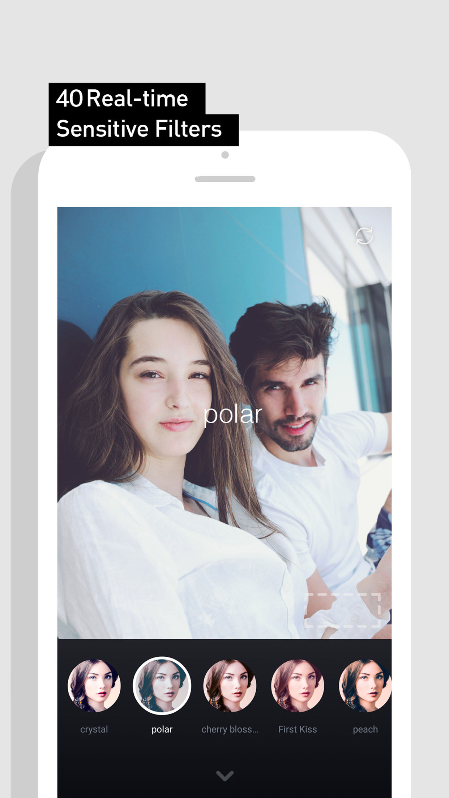

### 스프링
비율이 좋지 않게 나온 전신 사진의 비율을 좋게 만들어주는 사진앱 (키늘리기, 다이어트, 얼굴 축소)
- 기간 : 2014/06/03 ~ 현재
- 소속 : 선데이벅스
- 역할 : Android, iOS, OpenGL
- 사용기술 : Java, Objective-C

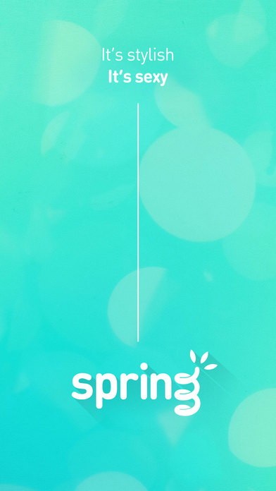  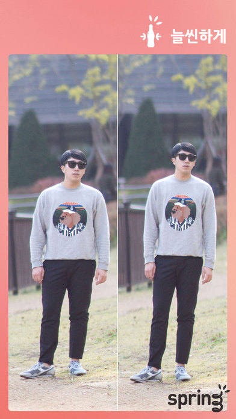 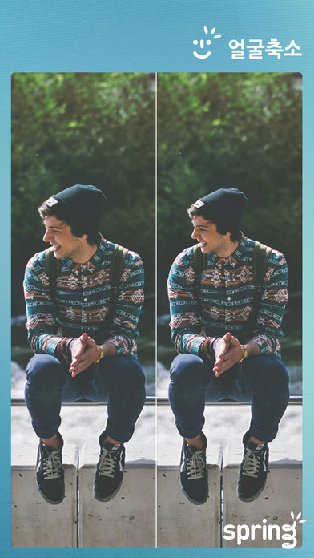 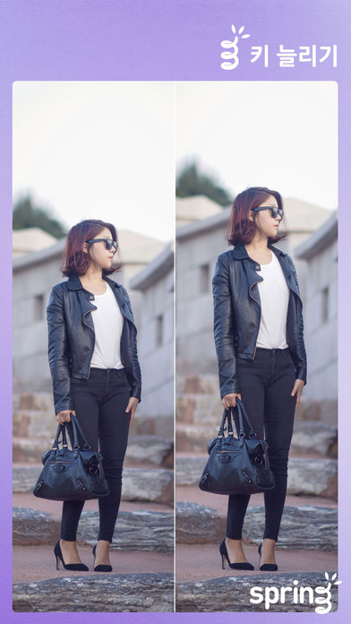

### 버킷플레이스
인테리어 서비스를 모아보는 플랫폼 
지금은 오늘의집이라는 서비스로 변경
- 기간 : 2013/09/01 ~ 2014/09/01
- 소속 : 버킷플레이스
- 역할 : 서버 및 웹
- 사용기술 : RubyOnRails, jQuery, HTML, CSS
